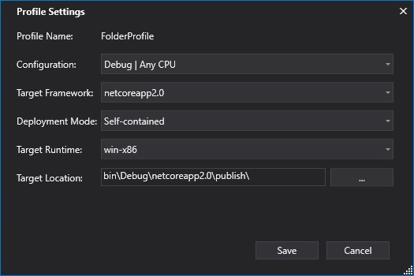
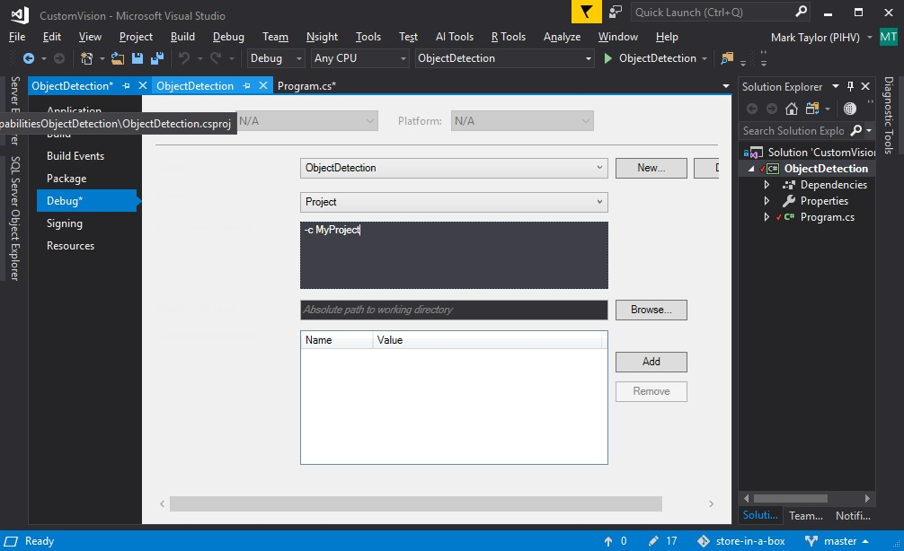
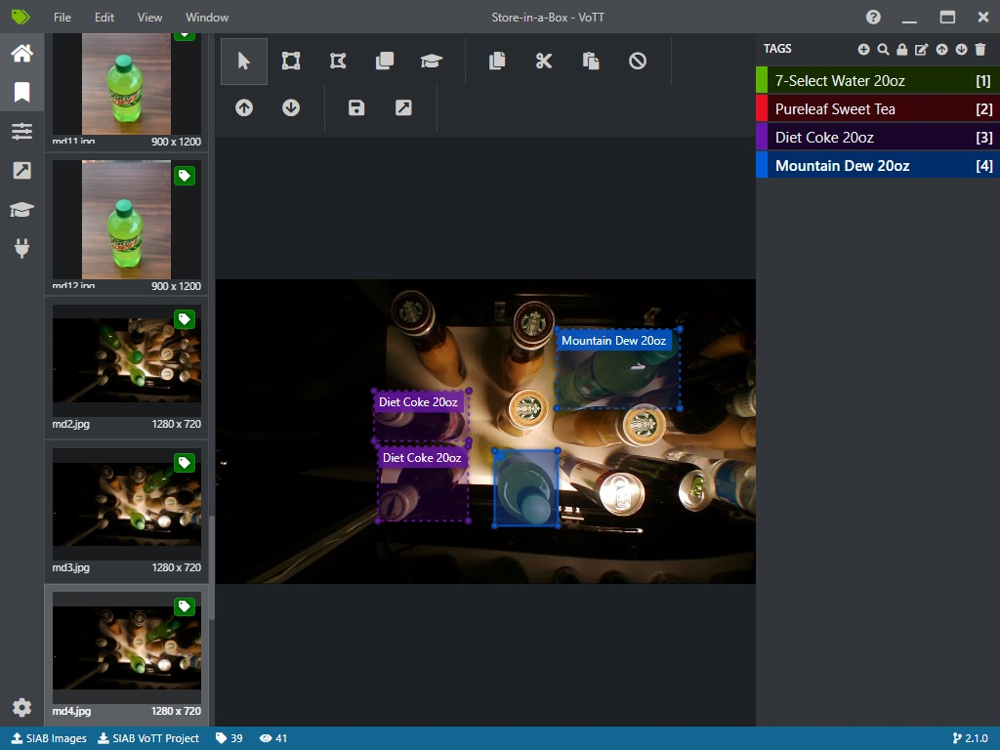
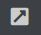
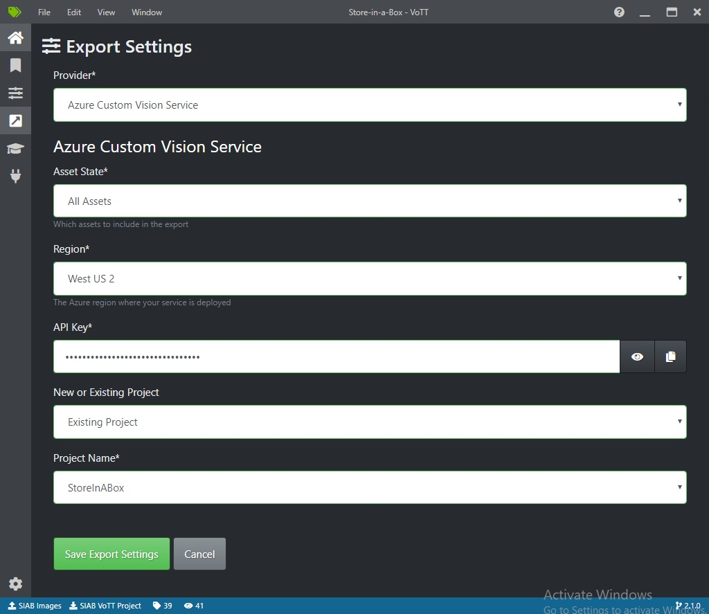
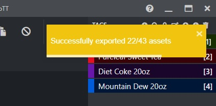
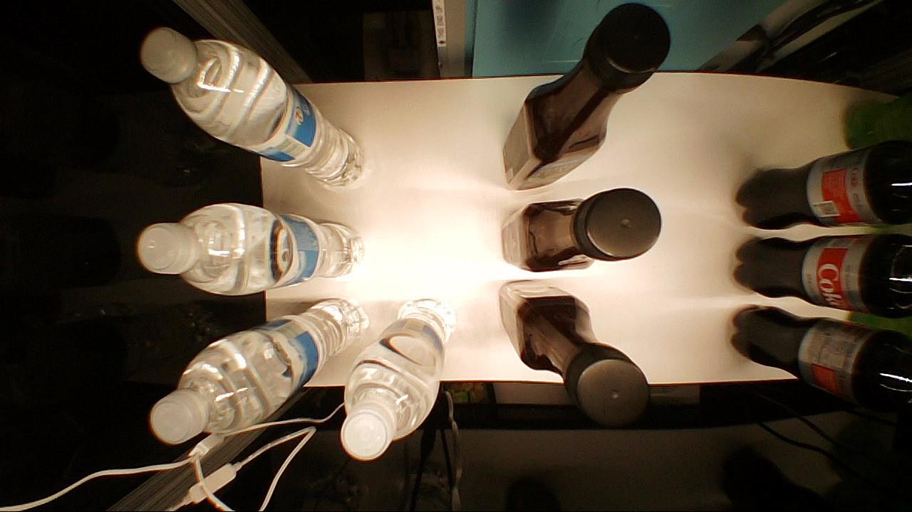
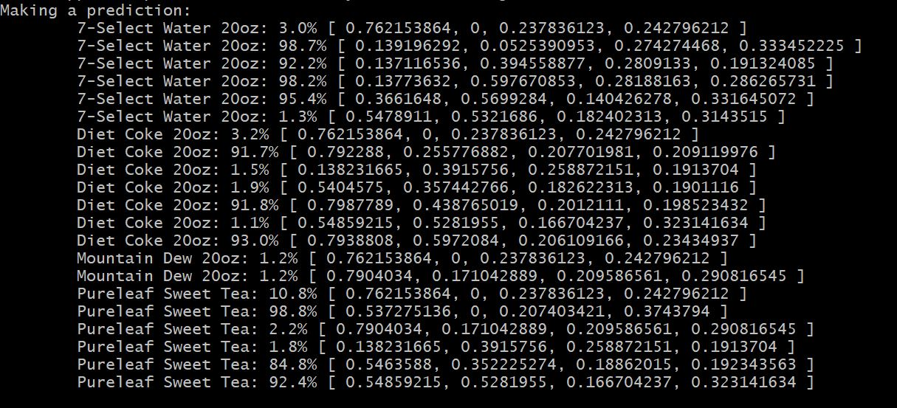
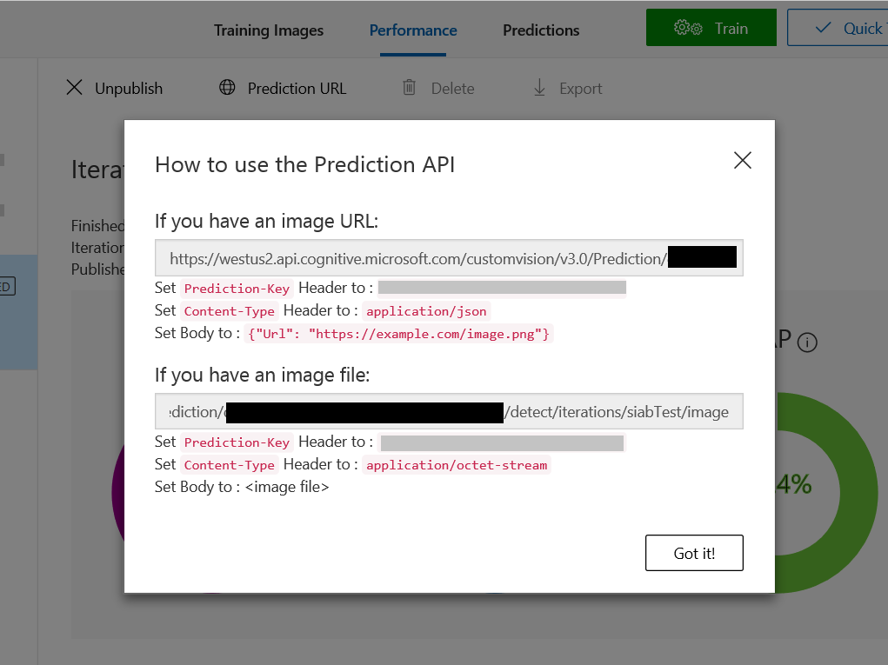

# Store-in-a-Box: Custom Vision Model
There are two ways you can build and train your Custom Vision model.  The first is the [custom vision portal](https://www.customvision.ai/projects). For a simple overview of this process, please check out the [QuickStart tutorial](https://docs.microsoft.com/en-us/azure/cognitive-services/custom-vision-service/get-started-build-detector).  This method is quick and intuitive, but it generally requires using the portal UI for annotation of training images, and it is difficult to work with the subsequent training data outside of the portal. There are APIs to export the data, but persisting and working with it become a non-trivial development exercise. If you want full control of the build and deploy pipeline, with all configuration and options in code, you can build and deploy the model using the API. For a good example, see the [QuickStart tutorial](https://docs.microsoft.com/en-us/azure/cognitive-services/custom-vision-service/csharp-tutorial-od).  
This folder contains a Visual Studio project for a console application which uses the API to achieve Custom Vision project creation, training of the model, publishing of the prediction endpoint, and testing the prediction endpoint by sending an image for analysis.  It also contains a project for 
the Visual Object Tagging Tool (VoTT), an application which makes it easy to create and upload annotated image training data for the Custom Vision Service.  Images and annotation data are also included to allow fast and easy testing of the solution with a real Custom Vision model.

While the portal comes with built in UI for labeling training data. You can use a tool such as [VoTT](https://github.com/microsoft/VoTT) to label data offline. This tool supports exporting labeled data to Azure Custom Vision Service, or to multiple other formats. Again, the portal is great for its intuitive interface and quick prototyping, but using the API combined with tools like VOTT can help facilitate an end-to-end Custom Vision machine learning pipeline.

## Prerequisites
1. Please install VoTT from [binaries](https://github.com/Microsoft/VoTT/releases) (recommended), or [build](https://github.com/microsoft/VoTT) and install it.

## Creating your Custom Vision Model
1. **Configure the ObjectDetection project** 
Open the project in Visual Studio. Change the constants at the top of the Program.cs file to reflect the information you saved from the resource deployment step. You can also find the information in the Azure Portal.  Key and endpoint data can be found in the 'Quick Start' pane. Note that the training key is from the training service, and the prediction key if from the prediction service.  You also need to collect the resourceID which can be found in the properties of the prediction service. When you have replaced the constants, rebuild the project in the configuration of your choice.  If you would like to produce an executable that can be run from the command line, configure your publish target options (right click on the project and select 'publish', then click on 'configure') as illustrated.  

This will generate an executable in a location like the following: store-in-a-box\01 - Custom Vision Model\ObjectDetection\bin\Debug\netcoreapp2.0\publish\ObjectDetectionApp.exe. You can call this executable from the command line in the steps below.

Alteratively, you could set the debug settings for each command parameters and run the steps using the Visual Studio debugger. To configure debug command line options, choose Debug from the project properties.

2. **Create Custom Vision project**  
Run the console app (as discussed above) using -c [project name] parameters.  This will create a Custom Vision project. To verify, you can look for the project in the [portal](https://www.customvision.ai/projects).

3. **Upload training images** 
Open VoTT and choose 'Open Local Project'
VoTT protects its data with tokens.  You will need to install the tokens specific to this project before loading the project.  The keys can be found in the ...store-in-a-box\01 - Custom Vision Model\images\VoTT_Project\SecurityTokens.txt.  Open this file.
Within VoTT, insert the keys by clicking into application settings (cog in lower left of the window)
Choose to add a security token for each token in the txt file.

To Save your settings, click the home icon to return to the main page, then click on 'Open Local Project'.  The project file you will open is: ...store-in-a-box\01 - Custom Vision Model\images\VoTT_Project\Store-in-a-Box.vott.
You should now see the annotated images in the application.

Click on the Export button  on the left toolbar. 
Configure the Export option for Azure Custom Vision Service using the information you collected from your Azure Resource Deployment, and your project creation activities. Save the settings.

Click on the export button in the top toolbar to export the annotated images to the Custom Vision project.  You will see a notification that export started, and another notification of the number of items exported.  Don't worry if only some (e.g. 28/43) assets export. 

4. **Train the model**
Now that your training data has been included in the project, you can train your Custom Vision model.  To do this, you will use the console application as before, but with the following options: ObjectDetectionApp.exe -t
Once the training has completed, you will have a working model based on your annotated training images.

5. **Publish the model**
In this step we will publish our model to a web service.  We can make rest calls to this service, passing in images and getting back object detections.
start from bin directory or debug using the following options: ObjectDetectionApp.exe -pub [published model name]
You can set any published model name that you would like.

6. **Test the model**
Test the model using an image file. If you would like to compare your results to ours, please use the image located at store-in-a-box\01 - Custom Vision Model\images\test\testImage.jpg.  Your results should approximately match those shown below.
start from bin directory or debug using -pred [image file]

7. **Retrieve prediction service information**
The easiest way to retrieve the information you will need to setup the kiosk application is to go through the [CustomVision portal](https://www.customvision.ai/projects). Locate your project, and then click on the "Performance" tab.  Go to the latest training iteration, and click on "Prediction URL" at the top of the page.  You will need the endpoint and prediction-key under "If you have an image file" for subsequent steps.  Record these somewhere for later reference.

**Troubleshooting**
If you run into problems, you can try completing any of the above activities in the [CustomVision portal](https://www.customvision.ai/projects). Any operation failing with the API will probably also fail in the portal, with an explanation of the failure.

## Additional Resources
* The console app is based on the CustomVision sample located here: https://github.com/Azure-Samples/cognitive-services-dotnet-sdk-samples
* For quickstart docs see here: https://docs.microsoft.com/en-us/azure/cognitive-services/custom-vision-service/csharp-tutorial-od

### *Notes*

In this Store in a Box prototype we use an object detection model. This provides information about where each of the items actually exist in relation to the camera, by defining a bounding box for each object. For the functionality demonstrated in this prototype, we could have used a classification model instead. This type of model simply reports each item it recognizes in the scene and generally is more performant as it is less sophisticated. As the solution moves beyond the prototype phase, there may be instances in which knowing the exact location of the product items becomes important. However, if you would like try the solution with a customized classification model, that is also a reasonable option.

The Object Detection console app has the following options...

ObjectDetectionApp.exe options: |
---------|
Use -c [project name] to create a project | 
Use -t to train the existing project |
Use -pub [published model name] to create a prediction service | 
Use -pred [image file] to find objects in the specified image |

To allow sharing of marked up sample data. We have provided a very small sample of labeled data for training. The sample sizes are much too small for real world applications, but they are provided to aid in getting a demonstration up and running quickly.
