# Store-in-a-Box: Kiosk Application
The store in a box represents a new type of food vending machine. It is essentially a refrigerated container with a Kiosk application running on the door.  The customer would swipe a credit card to gain access, then take whatever items they wanted and simply close the door. Product inventory and billing is managed by cameras and the AI model, which keep track of current inventory at beginning and end of the customer interaction. The Kiosk application is the heart of this system. 

The Kiosk application consists of a main, touchscreen application and associated libraries:

1. **Touchscreen Application** - this is a UWP application which pulls together several devices including cameras and SmartCard readers to prototype a Store-in-a-Box interface.  There is a customer purchase flow, and administrative view allowing flexible configuration of the system.
2. **Libraries** - a number of custom libraries are consumed by the touchscreen application.

Library | Function |
-------|-----|
StoreInABox.Containers_Unv | Provides structures representing the store model including Store, Shelf, and ProductItem. These containers are used to develop the data model for the application. |
StoreInABox.DeviceManagement_Unv | Includes classes to enumerate, manage, and utilize camera and smart card devices in the system.  In a physical kiosk, these would be expanded to include the enclosure and door locking mechanisms using, for example, the [Serial Communication APIs](https://docs.microsoft.com/en-us/uwp/api/windows.devices.serialcommunication). |
StoreInABox.CustomVision | Contains the configuration and API used to call the Custom Vision model and get predictions. |

In just few steps, you can setup a working prototype of a store in a box on your desktop:

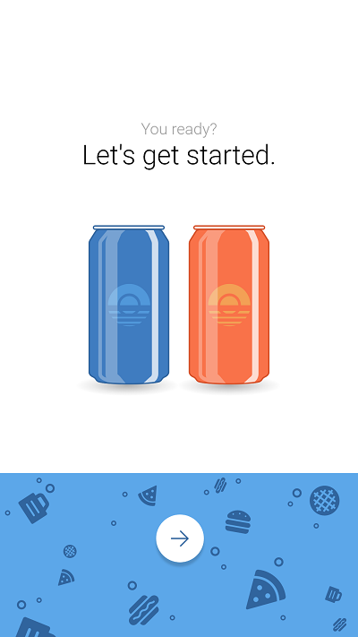

## Prerequisites
1. Visual Studio 2017 or newer
2. Webcam

## 1. If you are using your own model, update StoreInABox.Containers_Unv.Implementation_Unv ProductItems.cs (Optional)

The ProductItems() constructor should be updated to add the tags you have defined as product items from the model to its collection.  These also will be exposed as properties on the ProductItems class. 

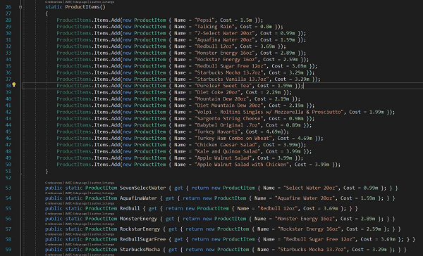

All other configuration can be made through the application UI.

## 2. Add additional customization
This prototype serves as a great baseline for a prototype store-in-a-box kiosk, however, you may want to make additional updates depending on your use case. 

## 3. Build and run the solution
Within Visual Studio, press the debug button or right click on the TouchscreenApp project and select debug to start the solution.

## 4. Configure the Kiosk
To configure the kiosk, click in the uppermost right most corner of the application.  This will present a mock login screen.  The username and password are hard-coded in the application...

|
-------|
UserName: admin |
Password: P@ssw0rd |

This is just a place holder for a secure logon implementation.

After logging in, you will see the configuration screen.  Here you can add shelves to your solution, add cameras to those shelves, input configuration data for the Custom Vision model service, as well as choosing the smart-card device to work with.

The available configuration options are detailed below:

Option | Notes |
-------|-------|
Choose Card Reader| This dropdown shows all card readers installed on the system.  Pick the card reader of your choice, or choose the 'No card reader' option to replace the functionality with a button. |
Prediction Key | Enter the prediction key obtained during the deployment of the Custom Vision prediction service (step 00). |
Prediction Endpoint | Enter the prediction Endpoint obtained during the deployment of the Custom Vision prediction service (step 00).|
Add Shelf | Add a shelf to the configuration.|
Add Camera | Hit the '+' sign next to all cameras on the right to add a camera to a shelf. To remove a camera, hit the '-' sign under the camera.|
Capture Images | Refresh the images from the cameras.  This is useful if you are attempting to figure out which camera instance to add to which shelf.|

Once the configuration has been defined, you can hit the back button to return to the kiosk store mode.  

The device configuration is stored in UWP application configuration.  The store configuration is persisted in a store.json file in app local storage (C:\Users\username\AppData\Local\Packages\ ).

## 4. Purchase Items
### A. Process Credit Card
To start the process, press the arrow at the bottom of the initial Kiosk screen. If you are running a simulation of the kiosk on the desktop, you may have to scroll down to see the bottom half of the interface (including the button).  After pressing the button, you will then be prompted to insert a card.  If you have a physical card reader, inserting a card will cause the processing payment screen to come up. Removing the card will simulate the door opening and take you to the interior kiosk view.

If you do not have a card reader, a "Process Card..." button will appear on the initial payment screen.  Pressing this button will result in the processing screen being displayed for several seconds before automatically taking you to the kiosk interior screen.

* ||
--|--|
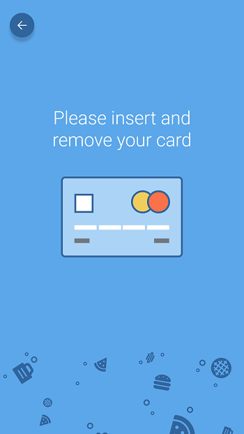 | 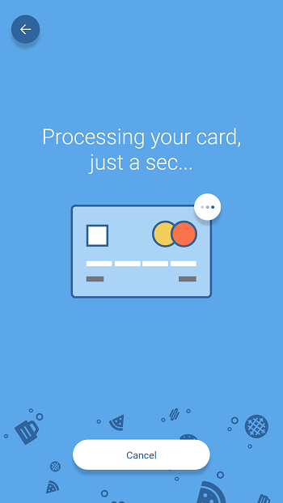 |

### B. Select Items
On the interior kiosk screen, you will see the shelves you defined, along with the images for the cameras defined for each shelf.  These images are processed to get an initial inventory for the Kiosk, and that inventory is displayed on the right of the screen.  
If you are using the example data to get up and running quickly, you can simply point your cameras at monitors displaying the images from the test images in store-in-a-box\01 - Custom Vision Model\images\test (see illustration below).

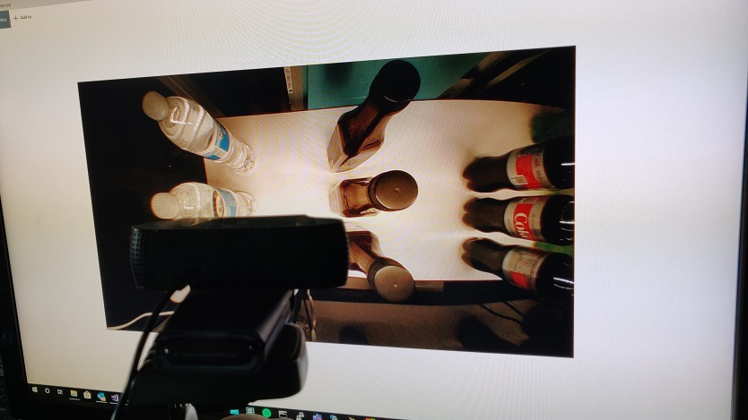
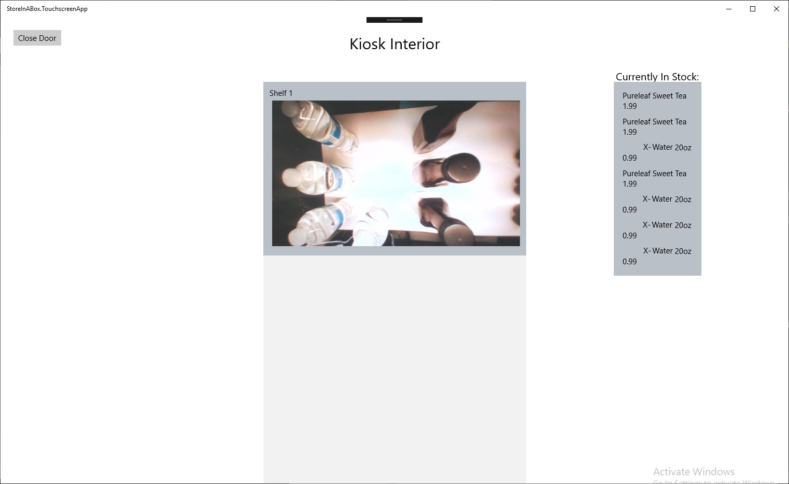

Next, change the image that the camera is pointing at to an image with some products missing (simulating taking something from the Kiosk).

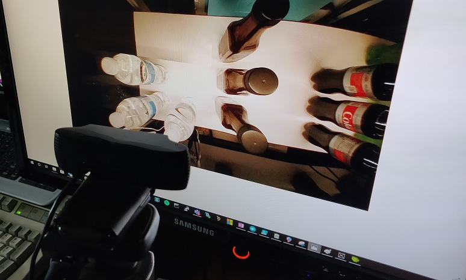

Press the "Close Door" button and you will see the new image, along with an updated inventory and shopping basket with your item in it. 

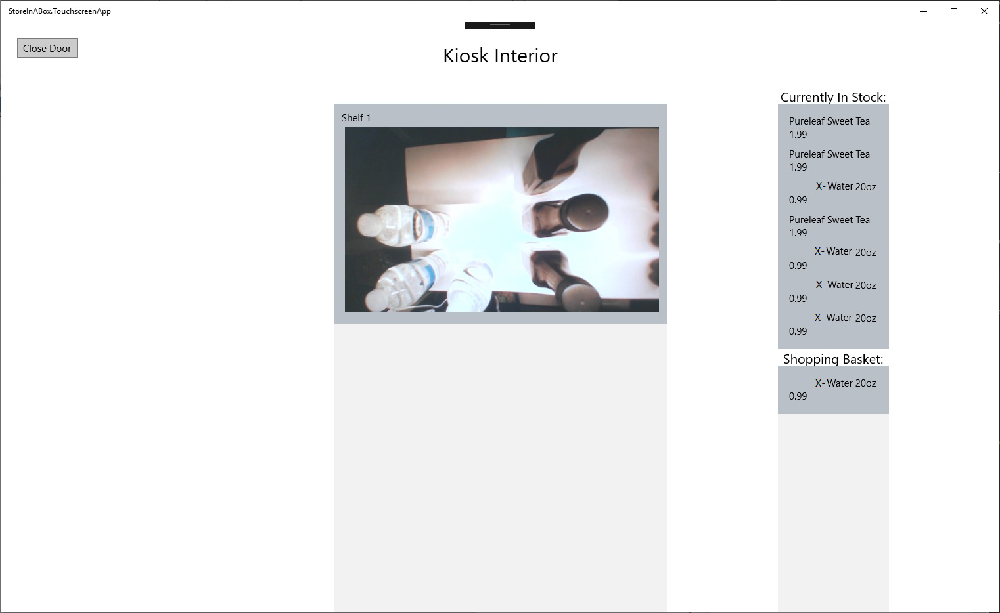

### C. Order Confirmation
This view will automatically switch to the Kiosk app screen indicating that the order is processing, and asking for confirmation of the order.

*||
-|-|
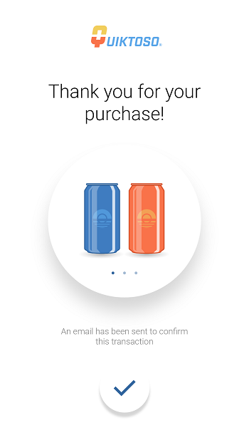 |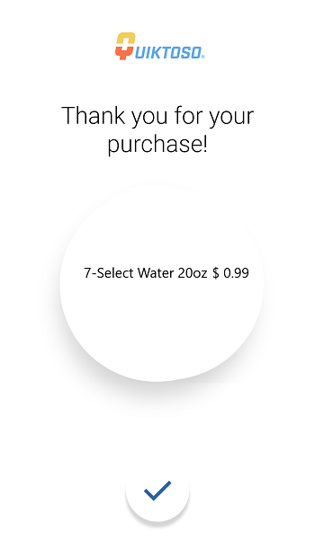 |

Once you have confirmed the order, You will see a thank you screen giving you the option of entering your phone number.

*||
-|-|
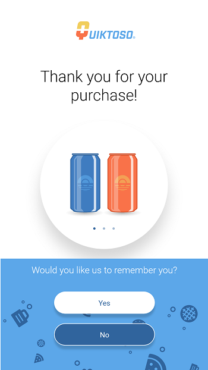 |  |

### *Notes*
This application was designed to be used on a touch screen kiosk.  To configure the application to run in Kiosk mode, see https://docs.microsoft.com/en-us/windows/configuration/kiosk-single-app 
