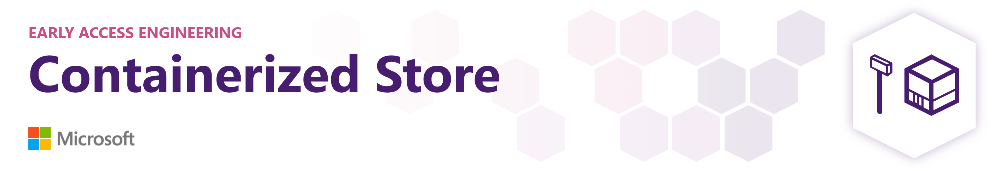
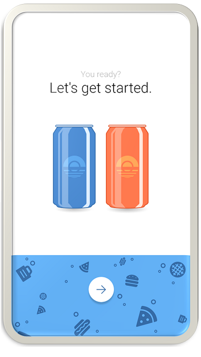

# Store-in-a-Box Solution Accelerator Guide
## About this repository
Welcome to the Store-in-a-Box Solution Accelerator!  This accelerator was built to provide developers with all of the resources needed to quickly build a vending kiosk prototype with [Azure Custom Vision](https://azure.microsoft.com/en-us/services/cognitive-services/custom-vision-service/).  Use this accelerator to jump start your development efforts with your own data or as a learning tool to better understand how Custom Vision AI can be transformative for the retail industry.

In this repository, we've provided you with all of the artifacts needed to quickly create a Custom Vision Solution including: templates for deploying the appropriate Azure resources, assets for creating your first Custom Vision project and training and testing your first model, and a retail kiosk application to demonstrate how your newly created AI model could be used as part of a retail solution. We've infused best practices throughout the documentation to help further guide you.

Once you have completed the steps in this guide, you'll have a kiosk application that simulates inventory and item tracking using Custom Vision. The Kiosk is pictured below:

 

## Prerequisites
In order to successfully complete your solution, you will need to have access to and or provisioned the following:
1. Access to an Azure subscription
2. Visual Studio 2017 or newer
3. [VoTT](https://github.com/Microsoft/VoTT) for annotating training images

## Training
The directions provided for this repository assume fundamental working knowledge of Azure Portal and programming constructs.  

For additional training and support, please see:
 1. [Write your first Windows 10 application](https://docs.microsoft.com/en-us/learn/modules/write-your-first-windows10-app/)
 2. [Azure Fundamentals](https://docs.microsoft.com/en-us/learn/paths/azure-fundamentals/)

## Getting Started and Process Overview
Clone/download this repo onto your computer and then walk through each of these folders in order, following the steps outlined in each of the README files.  After completion of all steps, you will have a working end-to-end solution.

### [00 - Resource Deployment](./00%20-%20Resource%20Deployment/README.md)
The resources in this folder can be used to deploy the required resources into your Azure Subscription. This can be done either via the [Azure Portal](https://portal.azure.com) or by using the [PowerShell script](./00%20-%20Resource%20Deployment/deploy.ps1) included in the resource deployment folder.  

Skip this folder if you have already provisioned the required resources or will be provisioning manually.

### [01 - Custom Vision Model](./01%20-%20Custom%20Vision%20Model/README.md)
This folder contains a Visual Studio Project, demonstrating how to create, train, deploy, and test a Custom Vision model using the API.  It also contains a Visual Object Tagging Tool (VoTT) project with training data ready to upload to your Custom Vision project repository.

### [02 - Kiosk Application](./02%20-%20Kiosk%20Application/README.md)
This folder contains a basic retail Kiosk application written as a Universal Windows (UWP) application. The Kiosk uses a Custom Vision model for product tracking and inventory.

## Special Thanks
Special thanks Microsoft's Early Access innovation Program (EAiP) and to Simon Middlemiss, JP DeCuire, Tony Carmalitano and Mark Taylor who wrote a large majority of the code here.

## License
Copyright (c) Microsoft Corporation

All rights reserved.

MIT License

Permission is hereby granted, free of charge, to any person obtaining a copy of this software and associated documentation files (the ""Software""), to deal in the Software without restriction, including without limitation the rights to use, copy, modify, merge, publish, distribute, sublicense, and/or sell copies of the Software, and to permit persons to whom the Software is furnished to do so, subject to the following conditions:

The above copyright notice and this permission notice shall be included in all copies or substantial portions of the Software.

THE SOFTWARE IS PROVIDED AS IS, WITHOUT WARRANTY OF ANY KIND, EXPRESS OR IMPLIED, INCLUDING BUT NOT LIMITED TO THE WARRANTIES OF MERCHANTABILITY, FITNESS FOR A PARTICULAR PURPOSE AND NONINFRINGEMENT. IN NO EVENT SHALL THE AUTHORS OR COPYRIGHT HOLDERS BE LIABLE FOR ANY CLAIM, DAMAGES OR OTHER LIABILITY, WHETHER IN AN ACTION OF CONTRACT, TORT OR OTHERWISE, ARISING FROM, OUT OF OR IN CONNECTION WITH THE SOFTWARE OR THE USE OR OTHER DEALINGS IN THE SOFTWARE
